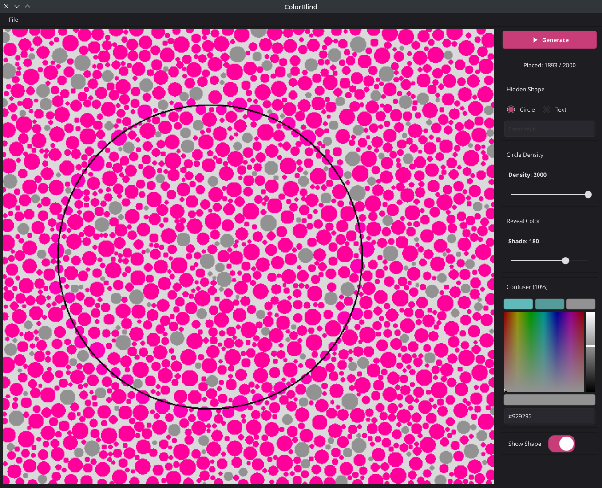
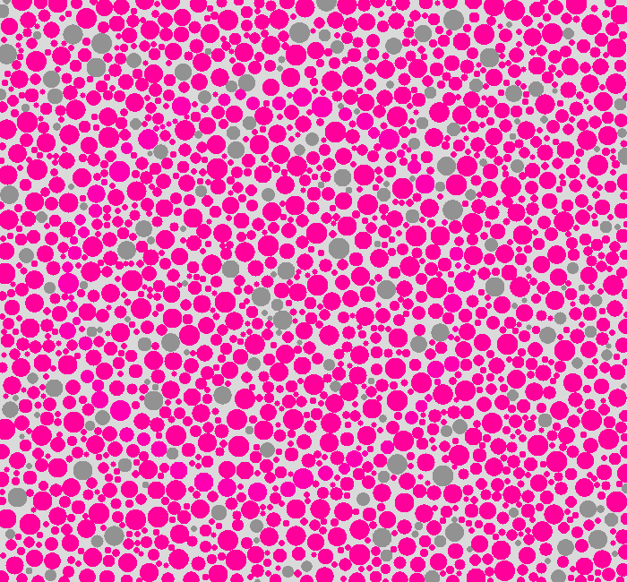

# HueCipher

A Go/Wails desktop application that generates Ishihara-style reverse colorblindness test plates.

The app fills a generated plate with thousands of same-colored circles, then recolors circles inside a hidden shape with a slightly different shade of magenta. To someone with normal color vision, the plate looks uniform. To someone with a specific type of color blindness, the hidden shape becomes clearly visible.

## How it works

Based on [this theory](https://www.reddit.com/r/ColorBlind/comments/2ds5u1/this_is_a_reversecolorblind_test_normal_color/cjsxha1):

(hit ctrl-f and press either 3 or 4 or 5)

```
12292191298792287899799826279226826216879
27623444335345433545335453345545545348229
29263341986998212627268726281262715442971
26925438718926278962289287162892783352796
27723351981892628296771928127129685348962
81775542289219262891891897982898925459267
12683358962896271298678926899719773437127
96194439961296129612926292962296825532199
21773547177921721772276822792127963349612
79125433554355454355333445453443554347217
89267892677298912161279672716721912179677
```

As viewed by a color regular, its just a block of numbers. As viewed by someone for whom 3s and 5s look like 4s, its

```
12292191298792287899799826279226826216879
27624444444444444444444444444444444448229
29264441986998212627268726281262714442971
26924448718926278962289287162892784442796
27724441981892628296771928127129684448962
81774442289219262891891897982898924449267
12684448962896271298678926899719774447127
96194449961296129612926292962296824442199
21774447177921721772276822792127964449612
79124444444444444444444444444444444447217
89267892677298912161279672716721912179677
```

a clearly identifiable shape.

The app applies this same principle visually — using two nearly identical magenta shades that only become distinguishable to people with specific color vision deficiencies.

## Screenshots





See [old output examples/](old%20output%20examples/) for outputs from the original Java version, or check out the [`original-java`](https://github.com/nikooo777/ColorBlind/tree/original-java) branch for the original JavaFX implementation — a learning project for OOP and JavaFX.

## Running the app

Check the [latest release](https://github.com/nikooo777/ColorBlind/releases/latest) first.

If there is a download for your operating system, use that instead of trying to run the source code.

Linux:

```bash
tar xzf huecipher-linux-amd64.tar.gz
./huecipher
```

Windows and macOS builds are not published yet. Until they are, you need to build the app from source.

## Build from source on Windows

Install these first:

- [Git](https://git-scm.com/download/win)
- [Go](https://go.dev/dl/)
- [Node.js LTS](https://nodejs.org/)

Then open PowerShell and run:

```powershell
git clone https://github.com/nikooo777/ColorBlind.git
cd ColorBlind
go install github.com/wailsapp/wails/v2/cmd/wails@v2.12.0
wails dev
```

To build a Windows `.exe`:

```powershell
wails build
.\build\bin\huecipher.exe
```

If `wails` is not found, close PowerShell, open it again, and retry the command.

## Prompt for AI Help

If you get stuck, paste this into ChatGPT, Claude, or another coding assistant:

```text
I am on Windows and want to run HueCipher from source.
Please guide me step by step using PowerShell commands.
First help me check whether Git, Go, Node.js, and Wails are installed.
The repo is https://github.com/nikooo777/ColorBlind.
The commands should eventually be:
git clone https://github.com/nikooo777/ColorBlind.git
cd ColorBlind
go install github.com/wailsapp/wails/v2/cmd/wails@v2.12.0
wails dev
If any command fails, ask me for the exact error and tell me the next command to run.
Do not assume I know programming.
```

## Build from source on Linux

Requires Go, Node/npm, the Wails CLI, and Wails Linux system libraries:

```bash
sudo apt install libgtk-3-dev libwebkit2gtk-4.1-dev
go install github.com/wailsapp/wails/v2/cmd/wails@latest
```

```bash
wails dev
```

Production build:

```bash
wails build
./build/bin/huecipher
```

## Controls

- **Generate** — creates a new plate with randomized circle positions and a hidden shape
- **Hidden Shape** — choose between a random circle or custom text as the hidden pattern
- **Density slider** — controls how many circles to place (10–7000); higher densities use smaller circles for a finer plate
- **Shade slider** — adjusts the magenta shade used for the hidden pattern; move it until the difference is barely perceptible to you
- **Confuser color** — pick a third color via swatches, color input, or hex input; it is applied to 10% of non-shape circles to add visual noise
- **Show Shape toggle** — reveals the hidden shape outline for verification
- **Save PNG** — export the current plate as a PNG image
